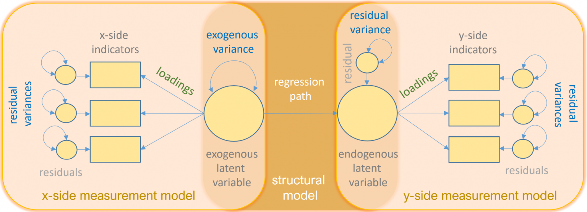
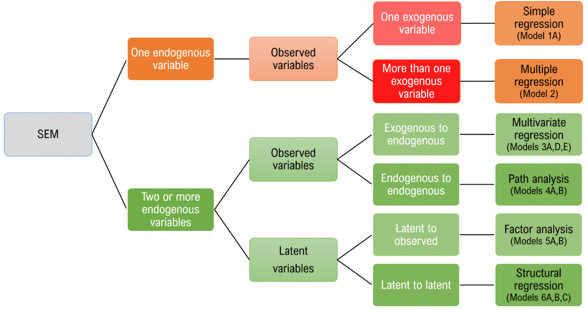

<br/><br/>

## Introduction
SEM is a covariance-based statistical methodology. It allows the researcher to test hypotheses about causal relationships, in much the same way as simple or multiple linear regression. It has three advantages over these techniques: **(1)** SEM allows an entire system of causal predictions to be tested simultaneously, rather than (as in the case of regression) one equation at a time; **(2)** SEM normally uses latent factors, typically representing overarching unobserved variables captured in the covariances of related observed variables, and this is beneficial because measurement error can be captured and controlled for; and **(3)** the validity of the overall model can be evaluated using global fit indices.

## Path diagram
Path diagram, the table below defines the symbols we will be using. Circles represent latent variables, squares represent observed indicators, triangles represent intercepts or means, one-way arrows represent paths and two-way arrows represent either variances or covariances.

```{r img-path, echo=F, fig.cap="Path diagram", out.width='80%', fig.asp=.75, fig.align='center'}

```
- https://stats.idre.ucla.edu/r/seminars/rsem/

## Framework
Structural equation modeling is a linear model framework that models both simultaneous regression equations with latent variables.  Models such as linear regression, multivariate regression, path analysis, confirmatory factor analysis, and structural regression can be thought of as special cases of SEM. SEM uniquely encompasses both measurement and structural models. The measurement model relates observed to latent variables and the structural model relates latent to latent variables.

```{r img-frame, echo=F, fig.cap="Framework", out.width='80%', fig.asp=.75, fig.align='center'}

```
- https://stats.idre.ucla.edu/r/seminars/rsem/


