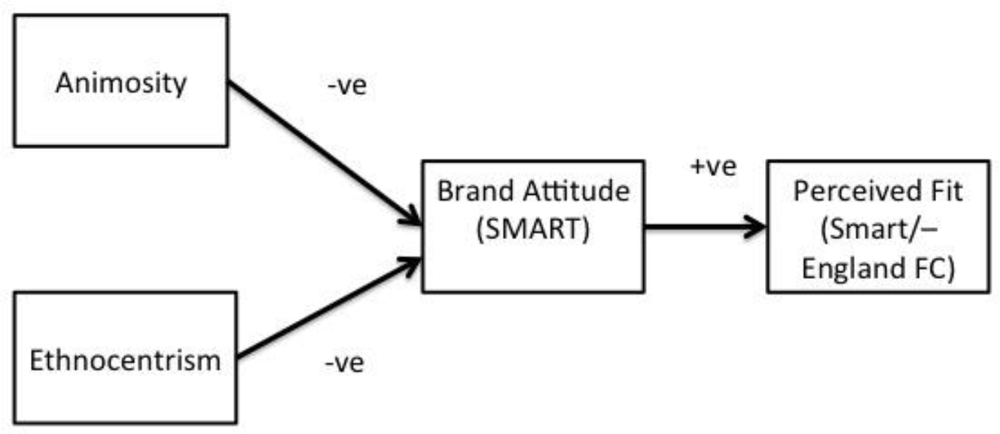

<br/>

## SEM using R package "lavaan"
The lavaan (**la**tent **va**riable **an**alysis) package is developed to provide useRs, researchers and teachers a free open-source, but commercial-quality package for latent variable modeling. You can use lavaan to estimate a large variety of multivariate statistical models, including path analysis, confirmatory factor analysis, structural equation modeling and growth curve models.

- https://lavaan.ugent.be/index.html

```{r}
#install.packages("lavaan", dependencies=TRUE, lib="~/lib/r-cran")
#install.packages("lavaan", dependencies=TRUE, lib="C:/Program Files/R/lib")
library(lavaan)
```

## Revisit theoretical model
We test whether animosity towards Germany and ethnocentrism more generally, predict consumer attitudes (ATT) towards German automotive brand SMART. We also investigate whether higher levels of ATT significantly improve perceptions of fit for a hypothetical sponsorship between SMART and the England international soccer team.
```{r img-model, echo=F, fig.cap="Theoretical model", out.width='80%', fig.asp=.75, fig.align='center'}

```

## Step 1: Confirmatory Factor Analysis
Let's build out the measurement model to include not only the two exogeneous variables discussed in the previous examples, but also the two endogeneous (dependent) variables stated in the theoretical model.
```{r}
#install.packages("lavaan", dependencies=TRUE, lib="C:/Program Files/R/lib")
#install.packages("lavaan", dependencies=TRUE, lib="~/lib/r-cran")
library(lavaan)

#specify model, latent variables
iss.model <- '
# measurement model
animosity       =~ ANI1 + ANI2 + ANI3 + ANI4
ethnocentrism   =~ ETHNO1 + ETHNO2 + ETHNO3
brand_attitude  =~ AT1 + AT2
brand_fit       =~ FIT1 + FIT2
'

#fit model
fit <- cfa(iss.model, data=dfs)

#check standardized factor loadings (check significance values <0.05)
#Standardized Regression Weights, all factor loadings are high (i.e., >.70)
#inspect(fit, what="std")

#check if model fits data, commonly accepted thresholds
#Chi-square: p > 0.05
#CFI: > 0.90
#TLI: > 0.95 (0.90)
#RMSEA: < 0.10
summary(fit, fit.measures=TRUE, standardized=TRUE)
```

## Step 2: Structural Equation Modelling
If the preceeding CFA produced acceptable results, then continue expanding the model with two directional regression analyses, i.e. the structural model, again according to the theoretical model.
```{r}
#specify model, latent variables, regressions, residuals, covariances
iss.model <- '
# measurement model
animosity       =~ ANI1 + ANI2 + ANI3 + ANI4
ethnocentrism   =~ ETHNO1 + ETHNO2 + ETHNO3
brand_attitude  =~ AT1 + AT2
brand_fit       =~ FIT1 + FIT2
# structured model, directional regressions
brand_attitude  ~ animosity + ethnocentrism
brand_fit       ~ brand_attitude
# residual correlations, endogeneous
#
# covariances, exogeneous variables
#animosity       ~~ ethnocentrism
'

#fit model
fit <- sem(iss.model, data=dfs)

#check if model fits data, commonly accepted thresholds
#Chi-square: p > 0.05
#CFI: > 0.90
#TLI: > 0.95 (0.90)
#RMSEA: < 0.10
summary(fit, fit.measures=TRUE, rsquare=TRUE, standardized=TRUE)
```

## Interpret results
Stated in the form of three directional hypotheses, the following predicted relationships are tested:

- **H1a:** Higher animosity towards Germany leads to a lower attitude towards SMART. 
- **H1b:** Higher ethnocentrism leads to a lower attitude towards SMART car brand. 
- **H1c:** A higher attitude towards SMART leads to a more favourable perception of its fit with the England soccer team as its primary sponsor.

## Wrap-up
- what is sem, concepts, short intro, confirmatory framework
- when do we use sem, social science, survey research, tpb
- what are the advantages of sem, multiple regression
- how can we work with sem, spss, r
```{r}
#
```


